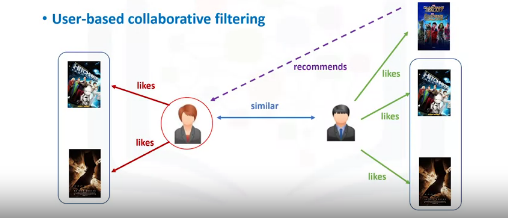

# Movie-Recommender-System

## Introduction to Recommender System

> Recommender systems are algorithms aimed at suggesting relevant items to users (items being movies to watch, text to read, products to buy or anything else depending on industries).

For example, if you’ve recently purchased a book on Machine Learning in Python and you’ve enjoyed reading it, it’s very likely that you’ll also enjoy reading a book on Data Visualization.People also tend to have similar tastes to those of the people they’re close to in their lives. Recommender systems try to capture these patterns and similar behaviors, to help predict what else you might like. As a proof of the importance of recommender systems, we can mention that, a few years ago, Netflix organised a challenges (the “Netflix prize”) where the goal was to produce a recommender system that performs better than its own algorithm with a prize of 1 million dollars to win.

## Types of Recommendar System

The purpose of a recommender system is to suggest relevant items to users. There are generally 2 main types of recommendation systems:

* Content-based and 
* Collaborative filtering.

Also, there are Hybrid recommender systems, which combine various mechanisms. In terms of implementing recommender systems, there are 2 types: 
* memory based 
* model based approaches.

> In memory-based approaches, we use the entire user-item dataset to generate a recommendation system. It uses statistical techniques to approximate users or items. Examples of these techniques include: Pearson Correlation, Cosine Similarity and Euclidean Distance, among others.

> In model-based approaches, a model of users is developed in an attempt to learn their preferences. Models can be created using Machine Learning techniques like regression, clustering, classification, and so on. 

## Collaborative filtering methods

Collaborative filtering is based on the fact that relationships exist between products and people's interests. Collaborative filtering is based on a user saying, “Tell me what's popular among my neighbors because I might like it too.” Collaborative filtering techniques find similar groups of users, and provide recommendations based on similar tastes within that group. In short, it assumes that a user might be interested in what similar users are interested in. 

For example, suppose you're building a website to recommend blogs. By using the information from many users who subscribe to and read blogs, you can group those users based on their preferences. For example, you can group together users who read several of the same blogs. From this information, you identify the most popular blogs that are read by that group. Then — for a particular user in the group — you recommend the most popular blog that he or she neither reads nor subscribes to. 

Collaborative filtering has basically two approaches:

* User-based

* Item-based

### User based collaborative filtering

User-based collaborative filtering is based on the user similarity or neighborhood. In user-based collaborative filtering, we have an active user for whom the recommendation is aimed. The collaborative filtering engine first looks for users who are similar. That is users who share the active users rating patterns. Collaborative filtering basis this similarity on things like history,preference, and choices that users make when buying, watching, or enjoying something.

   
   
   > Image taken from [coursera.org](https://www.coursera.org/learn/machine-learning-with-python)

For example, movies that similar users have rated highly. Then it uses the ratings from these similar users to predict the possible ratings by the active user for a movie that she had not previously watched. For instance, if two users are similar or are neighbors in terms of their interested movies, we can recommend a movie to the active user that her neighbor has already seen.

### Item based collaborative filtering

Item-based collaborative filtering is based on similarity among items.Item-item collaborative filtering is one kind of recommendation method which looks for similar items based on the items users have already liked or positively interacted with.Two items are considered to be similar if most of the users that have interacted with both of them did it in a similar way. It was developed by Amazon in 1998 and plays a great role in Amazon’s success.

It suggests an item based on items the user has previously consumed. It looks for the items the user has consumed then it finds other items similar to consumed items and recommends accordingly.

#### But how to find similar items? and what if there are multiple similar items in that case which item to suggest first? 

### References

* https://www.coursera.org/learn/machine-learning-with-python 
* https://www.ibm.com/developerworks/library/os-recommender1/index.html
* https://towardsdatascience.com/introduction-to-recommender-systems-6c66cf15ada
* https://towardsdatascience.com/comprehensive-guide-on-item-based-recommendation-systems-d67e40e2b75d

